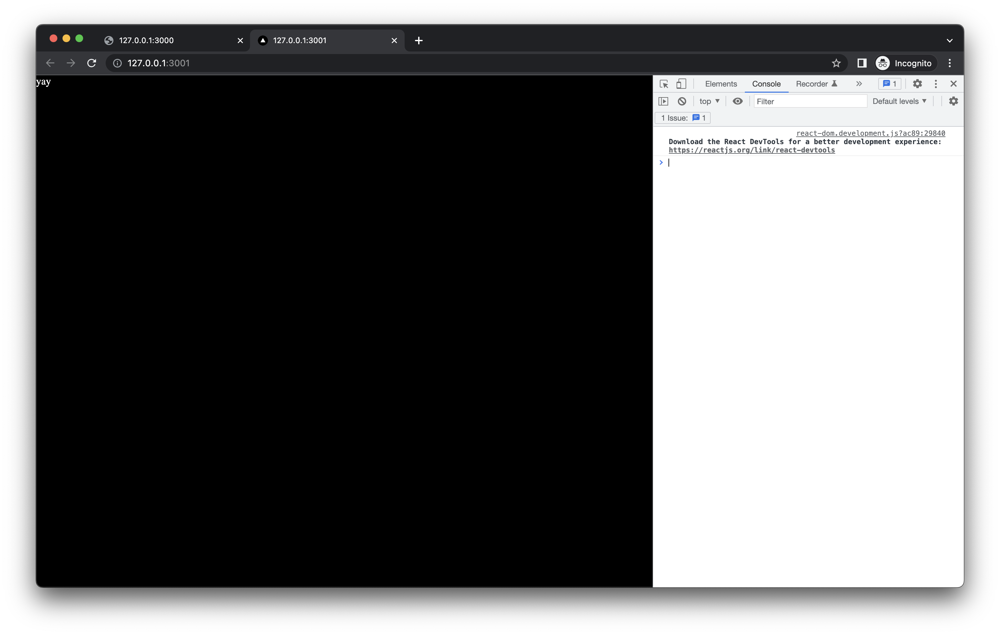

# mathjs issue repro

When `mathjs` is bundled in next.js, there are warnings about conflicting `Complex.js`/`complex.js` and `Fraction.js`/`fraction.js` files.

These seem to lead to an error:
```
Uncaught TypeError: Cannot read properties of undefined (reading 'prototype')
```
and the app doesn't load.

## Setup

### Clone this repo
```bash
git clone https://github.com/ryan-williams/mathjs-test
cd mathjs-test
yarn
```

### Or: create repro from scratch
Create app, install mathjs:
```bash
npx create-next-app mathjs-test --js --no-eslint
cd mathjs-test
yarn add mathjs
```

#### Invoke `complex` or `fraction` in [pages/index.js](pages/index.js):
```javascript
import {complex, fraction} from "mathjs"
export default function Home() {
    // Either of these lines causes an error
    // const n = complex(1, 1)
    const f = fraction(1, 2)
    return <div>yay</div>
}
```

## macOS: errors due to case-insensitive filesystem collision in mathjs
Run next.js server:
```bash
PATH="${PATH}:node_modules/.bin"
next dev
```
Open in browser:
```bash
open http://127.0.0.1:3000
```

<details><summary>Observe warnings</summary>

```
There are multiple modules with names that only differ in casing.
This can lead to unexpected behavior when compiling on a filesystem with other case-semantic.
Use equal casing. Compare these module identifiers:
* javascript/esm|/Users/ryan/c/mathjs-test/node_modules/mathjs/lib/esm/type/complex/Complex.js
    Used by 1 module(s), i. e.
    javascript/esm|/Users/ryan/c/mathjs-test/node_modules/mathjs/lib/esm/factoriesAny.js
* javascript/esm|/Users/ryan/c/mathjs-test/node_modules/mathjs/lib/esm/type/complex/complex.js
    Used by 2 module(s), i. e.
    javascript/esm|/Users/ryan/c/mathjs-test/node_modules/mathjs/lib/esm/type/complex/Complex.js
…
/node_modules/mathjs/lib/esm/type/fraction/Fraction.js
There are multiple modules with names that only differ in casing.
This can lead to unexpected behavior when compiling on a filesystem with other case-semantic.
Use equal casing. Compare these module identifiers:
* javascript/esm|/Users/ryan/c/mathjs-test/node_modules/mathjs/lib/esm/type/fraction/Fraction.js
    Used by 1 module(s), i. e.
    javascript/esm|/Users/ryan/c/mathjs-test/node_modules/mathjs/lib/esm/factoriesAny.js
* javascript/esm|/Users/ryan/c/mathjs-test/node_modules/mathjs/lib/esm/type/fraction/fraction.js
    Used by 2 module(s), i. e.
    javascript/esm|/Users/ryan/c/mathjs-test/node_modules/mathjs/lib/esm/type/fraction/Fraction.js
```
</details>

<details><summary>and error</summary>

```
index.js?46cb:606 Uncaught TypeError: Cannot read properties of undefined (reading 'prototype')
    at createComplexClass.isClass (Complex.js?51b2:11:3)
    at assertAndCreate (factory.js?2286:35:1)
    at eval (pureFunctionsAny.generated.js?b0ab:9:55)
    at ./node_modules/mathjs/lib/esm/entry/pureFunctionsAny.generated.js (index.js?ts=1672679205949:4021:1)
    at options.factory (webpack.js?ts=1672679205949:673:31)
    at __webpack_require__ (webpack.js?ts=1672679205949:37:33)
    at fn (webpack.js?ts=1672679205949:328:21)
    at eval (mainAny.js:11:88)
    at ./node_modules/mathjs/lib/esm/entry/mainAny.js (index.js?ts=1672679205949:4010:1)
    at options.factory (webpack.js?ts=1672679205949:673:31)
    at __webpack_require__ (webpack.js?ts=1672679205949:37:33)
    at fn (webpack.js?ts=1672679205949:328:21)
    at ./node_modules/mathjs/lib/esm/index.js (index.js?ts=1672679205949:9500:75)
    at options.factory (webpack.js?ts=1672679205949:673:31)
    at __webpack_require__ (webpack.js?ts=1672679205949:37:33)
    at fn (webpack.js?ts=1672679205949:328:21)
    at eval (index.js:7:64)
    at ./pages/index.js (index.js?ts=1672679205949:49:1)
    at options.factory (webpack.js?ts=1672679205949:673:31)
    at __webpack_require__ (webpack.js?ts=1672679205949:37:33)
    at fn (webpack.js?ts=1672679205949:328:21)
    at eval (?44d9:5:16)
    at eval (route-loader.js?ea34:211:51)
```
</details>


## Linux/Docker: works as intended
[Dockerfile](Dockerfile):
```Dockerfile
FROM node
RUN npx create-next-app mathjs-test --js --no-eslint
WORKDIR mathjs-test
RUN yarn add mathjs
COPY pages/index.js pages/index.js
EXPOSE 3000/tcp
ENV PATH="${PATH}:node_modules/.bin"
ENTRYPOINT ["next", "dev"]
```

Build, run, open:
```bash
docker build -t mathjs-test .
docker run --rm -d -p 3001:3000 mathjs-test
open http://127.0.0.1:3001
```

Page loads+renders without errors or warnings:


