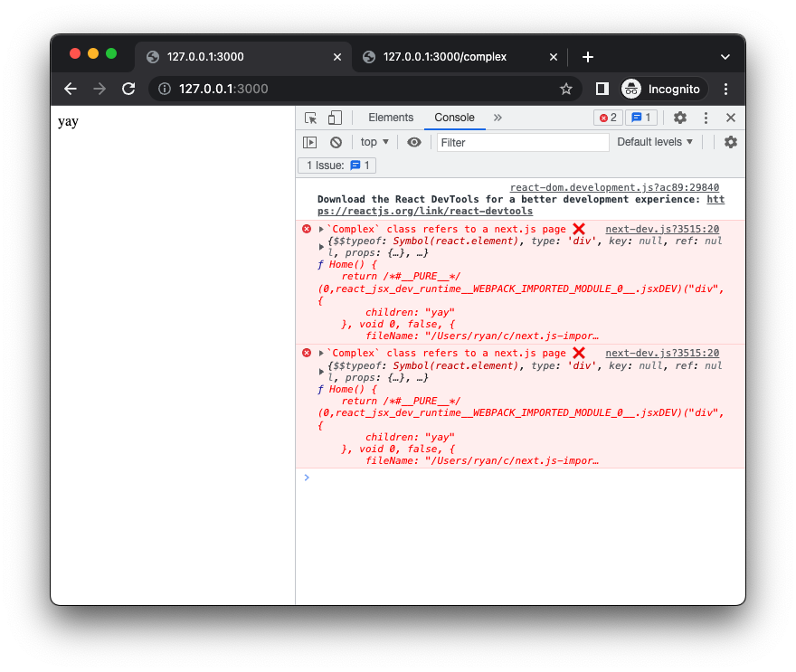
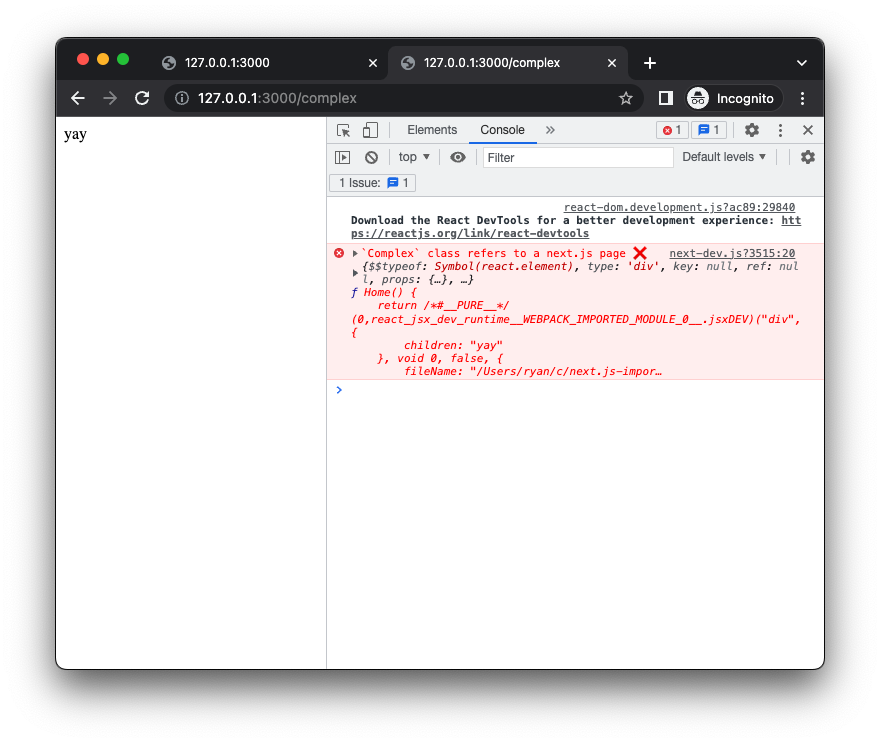
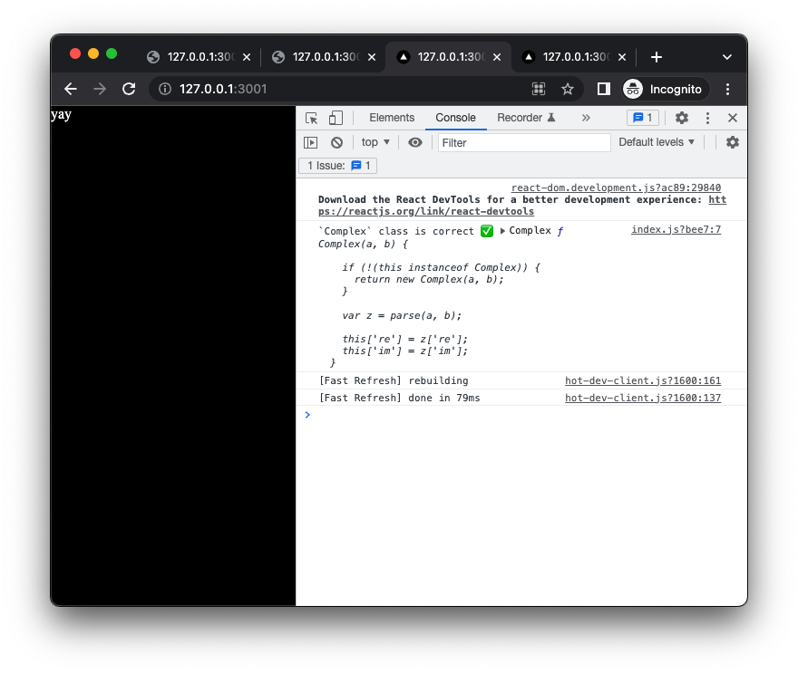
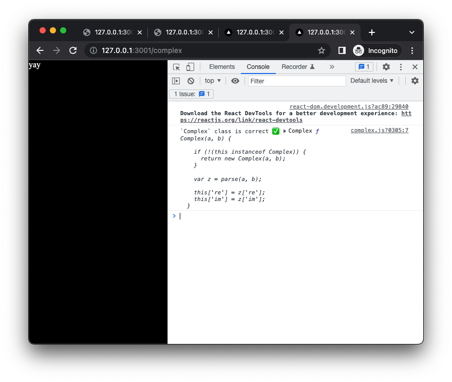

# next.js local/remote import issue repro

Next.js gets confused by the import:
```javascript
import Complex from "complex.js"
```
when [the `complex.js` NPM package](https://www.npmjs.com/package/complex.js) is present as well as a local file `./complex.js`. The import should resolve to the former, but next.js (or webpack, using next.js' default configs) appears to rewrite it like:

```diff
-import Complex from "complex.js"
+import Complex from "./complex.js"
```

See discussion at [mathjs#2870](https://github.com/josdejong/mathjs/issues/2870), and repro steps below. The issue originally seemed to result from ambiguity on a case-insensitive macOS filesystem. However, it wasn't reproducible on a case-insensitive windows filesystem, and the repro here no longer involves case-sensitivity. I've only observed it on my macbook (macOS 12.1), but it seems likely to have to do with next.js/webpack configs.

## Repro

### Clone this repo
```bash
git clone https://github.com/ryan-williams/next.js-import-bug
cd next.js-import-bug
npm i
```

### Or: create repro from scratch
Create app, install `complex.js`:
```bash
npx create-next-app next.js-import-bug --js --no-eslint --use-npm
cd next.js-import-bug
npm i --save complex.js
```

<details><summary>Create <code>pages/{index,complex}.js</code></summary>

```bash
# Create pages/index.js
cat >pages/index.js <<EOF
import Complex from 'complex.js'

const c = new Complex(11, 22)
if (!!c.props) {
  console.error('`Complex` class refers to a next.js page ❌', c, Complex)
} else if (c.re) {
  console.log("`Complex` class is correct ✅", c, Complex)
} else {
  console.error("`Complex` class not recognized:", c, Complex)
}

export default function Home() {
  return <div>yay</div>
}
EOF

# Create pages/complex.js with the same content
cp pages/{index,complex}.js
```
</details>


## macOS(?): errors due to apparent use of relative path instead of NPM package

Run next.js server, open in browser:
```bash
node_modules/.bin/next dev &
open http://127.0.0.1:3000
```

### Observe error

From [`pages/index.js#L5`](pages/index.js#L5):
```
`Complex` class refers to a next.js page ❌ {$$typeof: Symbol(react.element), type: 'div', key: null, ref: null, props: {…}, …} ƒ Home() {
    return /*#__PURE__*/ (0,react_jsx_dev_runtime__WEBPACK_IMPORTED_MODULE_0__.jsxDEV)("div", {
        children: "yay"
    }, void 0, false, {
        fileName: "/Users/ryan/c/next.js-impor…
```



Same error ([`pages/complex.js#L5`](pages/complex.js#L5):
) at [127.0.0.1:3000/complex](http://127.0.0.1:3000/complex):

```
`Complex` class refers to a next.js page ❌ {$$typeof: Symbol(react.element), type: 'div', key: null, ref: null, props: {…}, …} ƒ Home() {
    return /*#__PURE__*/ (0,react_jsx_dev_runtime__WEBPACK_IMPORTED_MODULE_0__.jsxDEV)("div", {
        children: "yay"
    }, void 0, false, {
        fileName: "/Users/ryan/c/next.js-impor…
```



## Linux/Docker: works as intended
[Dockerfile](Dockerfile):
```Dockerfile
FROM node
RUN npx create-next-app next.js-import-bug --js --no-eslint --use-npm
WORKDIR next.js-import-bug
RUN npm i --save complex.js
COPY pages/index.js pages/complex.js pages/
ENV PATH="${PATH}:node_modules/.bin"
ENTRYPOINT ["next", "dev"]
```

Build, run, open:
```bash
docker build -t next.js-import-bug .
docker run --rm -d -p 3001:3000 next.js-import-bug
open http://127.0.0.1:3001
```

Page loads+renders without errors or warnings:



Similarly at [127.0.0.1:3001/complex](http://127.0.0.1:3001/complex)



## Relevant versions
* node v19.3.0
* npm 9.2.0
* complex.js 2.1.1
* next 13.1.1
* macOS 12.1
